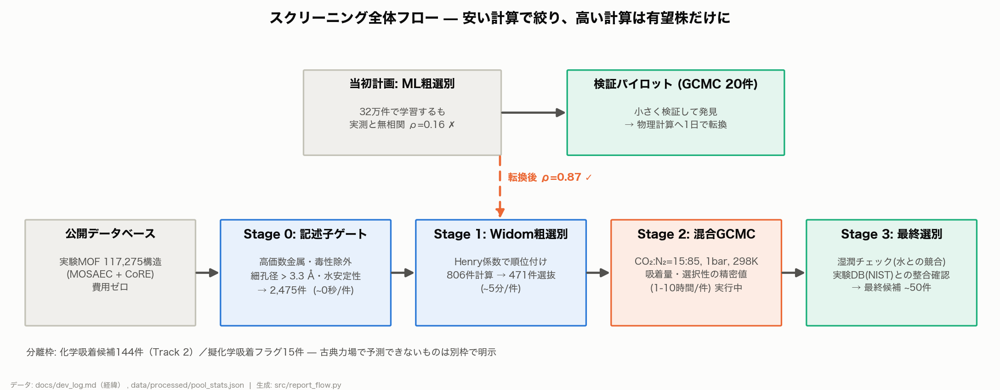
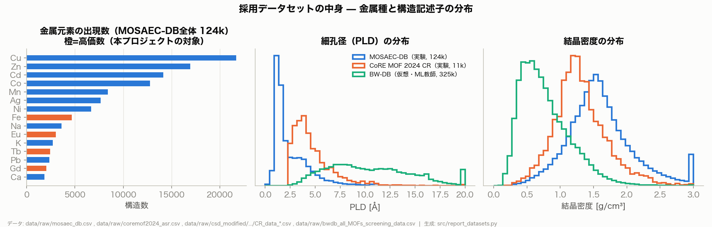

<!-- _class: dense -->

# データ駆動材料探索の進め方
## 〜湿潤排ガスCO₂回収MOFスクリーニングを題材に〜

**この資料の目的**: 公開データベースと計算科学を使った材料候補探索を、①実例の結果と②**他テーマに転用できる「進め方の型」**として共有する

| 何をしたか | 結果 |
|---|---|
| 公開DB 12万構造から水安定×湿潤CO₂吸着のMOF候補を絞り込み | **117,275 → 471件**（物理計算で最終選別中） |
| 費用 | データ購入費ゼロ・計算はローカルPC（クラウド換算~$100相当） |
| 期間 | 約1週間（文献調査〜GCMC本番投入まで） |

**持ち帰ってほしいこと（型の要点）**
1. 文献調査を先に — 手法・評価指標・先人の失敗を設計に焼き込む
2. **疑わしい仮定は小さく検証** — 本件ではML予測が実は無相関（ρ=0.16）と判明し、物理計算に転換（ρ=0.87）
3. 計算は階層的に投資 — 5分/件の粗選別で絞ってから3時間/件の精密計算へ
4. 予測できないものは「できない」と明示して分離する
5. 全判断を記録し、全図を再現可能にする

---

# 1. 課題設定 — なぜ「湿潤で動く水安定MOF」か

## 既存高性能材料の湿潤での失敗（文献より）

- **Mg-MOF-74**: 乾燥条件の吸着量王者だが、湿度70%暴露後は初期容量の**~16%しか回復しない**（Kizzie 2011）
- **HKUST-1**: Cuパドルホイールが加水分解し構造崩壊
- 実排ガスはほぼ飽和湿度 → **乾燥条件のランキングは実用の指標にならない**

## 要件の定義（材料化学の知見を最初に固定）

1. **構造の水安定性** — 金属–配位子結合の加水分解耐性は**金属価数（電荷密度）が支配**
   → Zr⁴⁺/Al³⁺/Cr³⁺/Ti⁴⁺/Fe³⁺/ランタノイドの高価数金属のみを対象とする
2. **湿度下でのCO₂吸着** — 水との吸着サイト競合を後段で評価する設計
3. 必須データ: CO₂吸着量・構造。歓迎: 電荷・吸着熱・耐水性ラベル

---

# 2. 道具立て — 計算で「吸着実験」をどう置き換えるか

化学実験との対応で3つだけ押さえれば本資料は読めます（詳細はAppendix用語集）:

| 計算手法 | 実験でいうと | 出てくる量 | コスト |
|---|---|---|---|
| **Widom挿入** | 無限希釈での親和性測定 | **Henry係数**（低圧吸着のしやすさ） | ~5分/構造 |
| **GCMC** | 吸着等温線測定（1点） | 吸着量 [mmol/g]・選択性・吸着熱 | 1〜10時間/構造 |
| ML予測 | 過去データからの外挿 | 上記の予測値 | ~0秒/構造 |

- 分子間力は古典力場（UFF＋TraPPE）＋**量子計算由来の原子電荷（DDEC6）**で記述
- 温度・圧力は排ガス条件に固定: **CO₂:N₂ = 15:85、全圧1 bar、298 K**
- 使用ソフト: RASPA2（吸着シミュレーションの標準・無償）

---

# 3. アプローチ全体像 — フローで見る



- 左→右へ「安い計算で絞り、高い計算は有望株だけに」。上段はML→物理転換の経緯（型③④）
- 件数の推移（ファネル図）は結果パート（p.13）とfigures/fig1参照

---

# 4. 型① 文献調査を設計に焼き込む

**着手前に3本の調査を実施**（各1日弱、AIエージェント併用）:

| 調査 | 主要な学び | 設計への反映 |
|---|---|---|
| 手法の系譜（~40本） | 「ML粗選別→GCMC確定」が定石。ただし**仮想DB学習モデルは実験構造で劣化**（Moosavi 2020） | MLを疑ってかかる検証計画 |
| 評価指標 | **単純指標はプロセス性能と相関しない**（Farmahini 2021）。湿潤ではHenry比・硬い閾値が勝者を落とす（CCST 2026） | ゲートとランキングの分離・早期は緩く |
| 水安定性データ | 実験ラベル集WS24・ML予測付きDB（CoRE 2024）の存在 | 水安定性を自作せず既存資産を活用 |

**教訓**: 調査コスト2〜3日で、後工程の手戻りを大幅に回避。特に「先人の失敗」
（ML転移性・指標の罠）を先に知っていたことが、後述の方針転換を**1日で**可能にした

---

# 5. 型② データセット選定 — なぜこの組み合わせか

**5つの公開DBを役割分担で採用**（単一DBでは要件を満たせない）:

| 採用DB | 役割 | 採用理由 |
|---|---|---|
| **MOSAEC-DB** (124k, 2025) | 母集団の土台 | 実験構造で最大級＋**金属の酸化状態を検証済み**（高価数フィルタの信頼性に直結）。既知DBの構造エラー率の高さを暴いた同グループの成果物 |
| **CoRE MOF 2024/25** (43k) | ラベルとCIF供給 | **水安定性ML確率・疎水性クラス・量子電荷を全構造に同梱** — 自作すれば数ヶ月の資産が無償 |
| **BW-DB** (325k, 仮想) | ML教師データ | 排ガス条件そのもの（0.15 bar混合GCMC＋吸着熱）のラベル32万件 |
| Keskin 2018 (3.8k) | 校正 | 実験構造でのGCMC選択性 → 仮想→実験のズレ測定用 |
| WS24 (1.1k) | 裏取り | 水安定性の**実験**ラベル（ML予測の検証基準） |

**不採用と理由**: CoRE 2019（高価数が368件で不足）/ CSDフル（ライセンス必要）/
hMOF・ToBaCCo（仮想・金属偏り）/ QMOF（吸着ラベルなし）— 検討過程は調査文書に記録

---

# 5b. 採用データの中身 — 分布を見てから使う



- **金属（左）**: 実験MOFはCu/Zn/Cd（低価数・水に弱い）が多数派。高価数（橙）縛りで母集団は~15%に
- **細孔径（中）**: 実験DBは狭細孔優勢。**ML教師のBW-DB（仮想）は大細孔側** — ML不調の伏線
- **密度（右）**: 仮想DBは軽い骨格に偏る

**教訓: 分布を見てから設計する** — 母集団サイズ見積もり・ML転移リスク・Tier設計はここから導出

---

# 6. 型③ 疑わしい仮定は小さく検証する

## 「ML粗選別は使える」という仮定を20件のGCMCで検証した


- 学習指標は良好（R²=0.59-0.83）でも、実験構造20件との**順位相関はρ=0.16 — ほぼ無相関**
- 原因は教師データ（仮想・Cu/Zn・大細孔）と適用先（高価数・狭細孔）の分布ズレ（前頁の伏線）

---

# 7. 型④ ダメなら物理に戻る — 転換の成果

## ML → Widom挿入（物理計算）への置換を1日で実施

| 粗選別手法 | GCMC実測との順位相関 | コスト |
|---|---|---|
| ML（BW-DB学習） | ρ = 0.16 | ~0秒/件 |
| **Widom挿入（物理）** | **ρ = 0.87** | ~5分/件 |


- 806構造で全数成功・計算警告ゼロ。サイクル数削減の妥当性も基準値と1%差で確認
- **「速いが当たらない」より「5分かかるが当たる」** — 粗選別に必要な精度をコストで買った

---

# 8. 型⑤ 計算は階層的に投資する

```
      コスト/件         件数           役割
記述子   ~0秒     117,275 → 2,475   ゲート（化学の知識で足切り）
Widom    ~5分       806 → 471       物理ベースの順位付け
GCMC    1-10時間     471 → ~100     精密値（作業容量・選択性）
湿潤評価  重い       ~100 → ~50      最終判断（水との競合）
```

- **高価な計算は、安い計算で絞ってから** — 全構造にGCMCなら~1年分の計算が、階層化で~1週間に
- パイロット20件で実行時間を実測してから本番計画（見積もりを実測で置換する習慣）
- 有望順に処理する設計 — 途中で止めても「上位から順に結果が揃っている」状態を保つ
- 品質保証も段階的: 収束トレース確認（fig11）・サイクル削減は基準値と1%差で妥当性確認

---

# 9. 型⑥ 予測できないものは分離する

**古典力場GCMCは物理吸着しか記述できない** — この限界を3つの分離で明示化:

| 分離枠 | 件数 | 扱い |
|---|---|---|
| Track 2: アミン系（化学吸着） | 144 | 定量予測から除外し、別枠の定性評価リストへ |
| 擬化学吸着フラグ（Henry係数>1 mol/kg/Pa） | 15 | 静電トラップが深すぎ古典力場の信頼域外。別枠レビュー |
| OMS（配位不飽和金属サイト）上位群 | — | 数値は保持するが「乾燥条件の上限値」として解釈を限定 |

**教訓: モデルの適用範囲を宣言し、範囲外を「予測できない」と正直に出す。**
範囲外を黙って混ぜると、最も派手な（そして最も怪しい）数字が上位を占拠する

---

# 10. 型⑦ すべて記録し、再現可能にする

| 仕組み | 実体 |
|---|---|
| 開発ログ | `docs/dev_log.md` — **判断の理由**を時系列記録（なぜML→物理か、なぜこのDB か…） |
| 図↔データ対応表 | `docs/figures/README.md` — 全17図の元データと生成スクリプト。**図の左下にも出典を印字** |
| 閾値の出典管理 | `config.py` に一元化し、各閾値に文献根拠をコメント |
| データ取得の再現 | `src/download.py` — 全DBのURL・展開を自動化（誰でも同じ環境を再構築可能） |
| 品質ゲート | 計算警告の自動カウント・完了マーク検知（無効な結果が混入しない） |

**バグも記録**: 力場マッチング不全（VDW欠落で吸着量18 mol/kgの異常値）、
重複排除でのデータ消失など、**検出の経緯と対処をログ化** — 次のプロジェクトの点検リストになる

---

# 11. 結果① ファネル実績と現在地

| Stage | 件数 | 状態 |
|---|---|---|
| 入力（MOSAEC＋CoRE） | 117,275 | — |
| 高価数金属・毒性除外 | 18,790 | ✅ |
| ＋細孔径 > 3.3 Å | 5,758 | ✅ |
| ＋水安定性ゲート → **Track 1母集団** | **2,475**（Tier A 433/B 927/C 1,115） | ✅ |
| Widom挿入（CIF入手済み分） | 806 | ✅ 全数成功 |
| **混合GCMC本番** | **471** | 🔄 実行中（~5日、有望順に確定中） |

- 水安定性の根拠は全構造に記録: 実験ラベル50 / ML予測1,464 / 化学則961
- CIF未入手分（CoRE未収録のCSD構造）は最終候補確定後に個別取得で追補可能

---

# 12. 結果② なぜ上位MOFは強いのか（記述子分析）


1. **吸着量は幾何でなくOMSが支配**（3.6倍差） — 狭細孔帯に揃えた後は「サイトの強さ」の勝負
2. **選択性は密で狭いほど高い** — 閉じ込め＋静電場がCO₂の四重極子を選択的に掴む
3. **乾燥の勝者は親水寄り** — 強い静電サイトは水も引き付ける。**湿潤評価で順位逆転が濃厚**
   （これは湿潤CO₂回収という問題の本質的ジレンマ。Boyd 2019のアドソルバフォア設計と同じ課題意識）

---

# 13. 結果③ 吸着の実像 — CO₂はどこに座るか


- 時間平均の密度マップ: CO₂は細孔内に一様分布せず、**チャネル壁の特定サイトに局在**
- 瞬間スナップショット・**マウスで回せる3Dビュー**（`docs/viewer_*.html`）も生成済み
- 最終候補ではOMS有無での密度マップ比較 → 湿潤耐性の構造的解釈へ

---

# 14. 検証計画 — 実験データとの整合性確認（NIST ISODB）

**計算だけで閉じない。** 文献の実験吸着等温線DB（NIST/ARPA-E ISODB、4,647文献・無料API）
との突合を2ルートで実施する:

| ルート | 内容 | 実測済みの実現性 |
|---|---|---|
| ① 候補との直接比較 | 出典論文DOIで候補とISODBを機械突合し、実測CO₂等温線と比較 | **Stage 2対象で4件・母集団で12件が一致**（API疎通・突合コード動作確認済み） |
| ② ベンチマーク検証 | UiO-66等の有名MOFに同一パイプラインを適用し実測等温線と比較 | UiO-66(RUBTAK, Zr系)は母集団内。ISODBにCO₂等温線多数 |

- 直接一致が少ないのは「構造報告のみで吸着未測定」の構造が大半のため
  — **未開拓領域を探せている**ことの裏返しでもある
- 併用中の校正: Keskin 2018（実験構造のGCMC 3,816件）、WS24（水安定性の実験ラベル）

---

# 15. 限界の正直な記載

1. **古典力場のOMS精度** — 強い金属サイトの絶対値は信頼域の端。擬化学吸着分離＋
   ベンチマーク検証（前頁）＋最終候補での吸着熱感度確認で対処
2. **現時点は乾燥条件** — 湿潤評価（水との競合）はStage 3で実施。親水上位群の失速を予想済み
3. **CIFカバレッジ** — 物理計算済みは母集団の1/3（残りはCSDライセンス構造。最終候補のみ個別取得可）
4. **ランタノイドの水安定性ラベルはML予測依存** — 最終候補で文献裏取り
5. ライセンス: CoRE CSD-modified CIFはCC BY-NC-SA（アカデミック利用の整理で運用中）

---

# 16. ロードマップと展開可能性

## 本テーマの残り
1. GCMC完走（~5日）→ 作業容量×選択性Pareto → **湿潤チェック** → 最終候補~50件
2. NIST ISODB検証（前述2ルート）→ 最終報告書
3. （将来）上位候補の合成・実測への引き継ぎ

## この「型」の転用先
- **同じ道具立てがそのまま使える**: 他ガス分離（CH₄/N₂、H₂精製）、水蒸気吸着（除湿・水回収）
- **型だけ転用**: 触媒担体・イオン伝導体など「公開DB×計算スクリーニング」が成立する材料系全般
- 資産: データ取得〜可視化の全コード、環境構築手順、判断記録 — リポジトリ一式で引き継ぎ可能

---

<!-- _class: dense -->

# Appendix: 用語集

| 用語 | 意味 |
|---|---|
| MOF | 金属イオンと有機配位子からなる多孔性結晶。細孔にガスを吸着する |
| GCMC | グランドカノニカルモンテカルロ。指定温度・圧力での平衡吸着量を統計的に計算する標準手法 |
| Widom挿入 | 分子を仮想的に挿入して親和性を測る軽量計算。無限希釈のHenry係数が得られる |
| Henry係数 | 低圧極限での吸着量/圧力。大きいほど低圧で吸着しやすい |
| PLD / LCD | 細孔の入口径 / 最大空洞径。PLD > ガス分子径でないと拡散できない |
| OMS | 配位不飽和金属サイト。強い吸着点になるが水も強く吸着する諸刃の剣 |
| 力場 / DDEC6電荷 | 分子間力の古典近似 / 量子計算から導いた原子部分電荷 |
| Tier A/B/C | 水安定性の金属分類: A=Zr/Hf/Ti/Al/Cr純系、B=+Fe/Sc/In/Ga、C=+ランタノイド |
| BW-DB, MOSAEC-DB, CoRE MOF, WS24, ISODB | 本文参照（公開データベース群） |

**主要文献**: Boyd+ *Nature* 2019 / Moosavi+ *Nat.Commun.* 2020 / Farmahini+ *Chem.Rev.* 2021 /
Kancharlapalli & Snurr 2023 / Terrones+(WS24) *JACS* 2024 / Zhao+(CoRE) *Matter* 2025
— 全リスト: `docs/literature_survey_ml_mof_screening.md`
