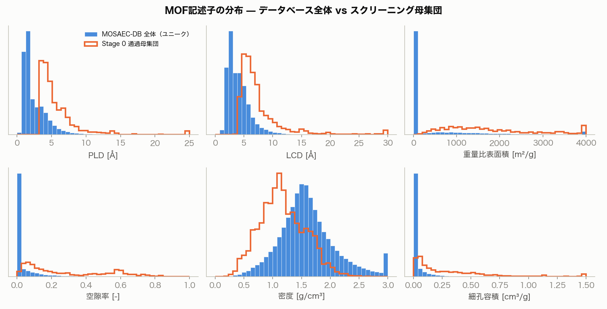
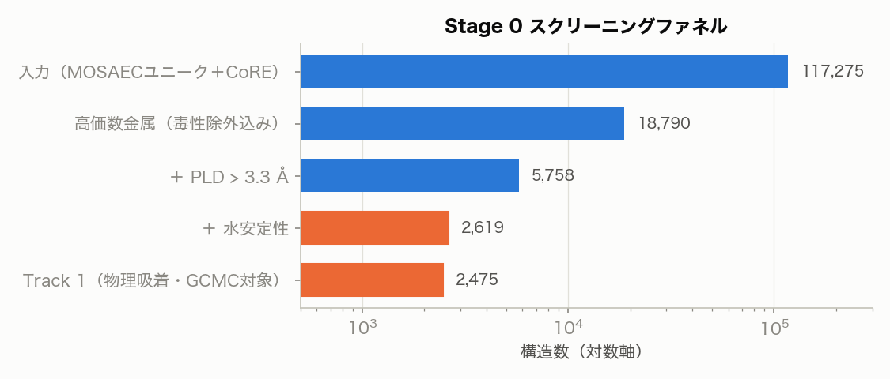
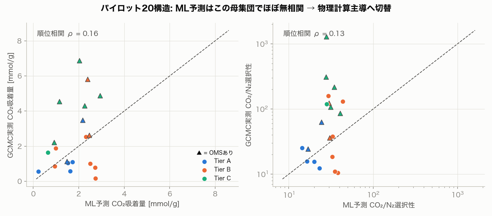
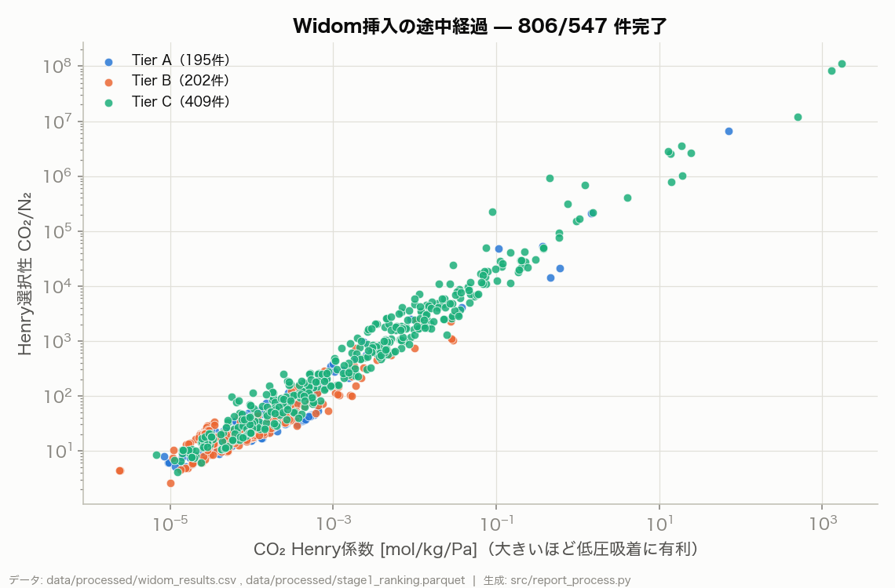
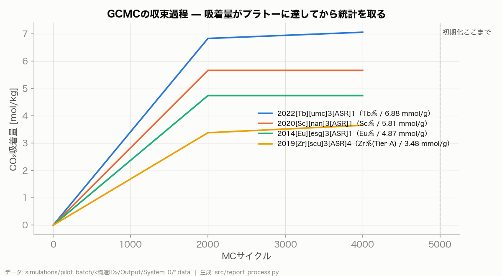
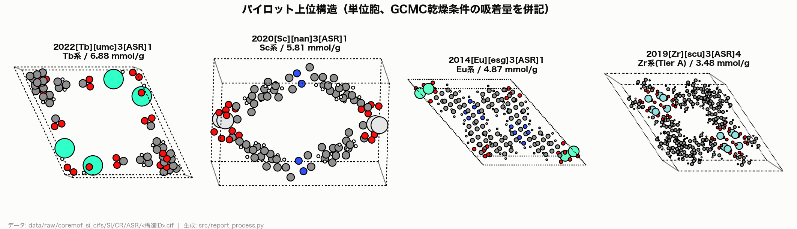
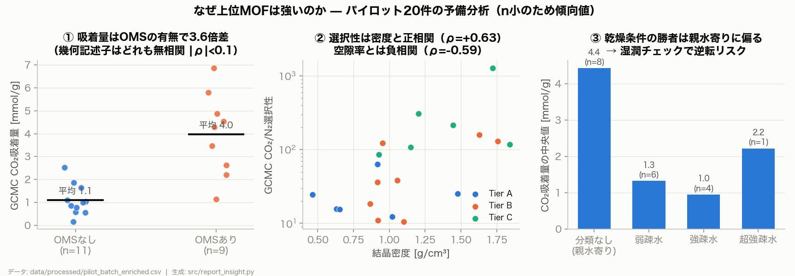
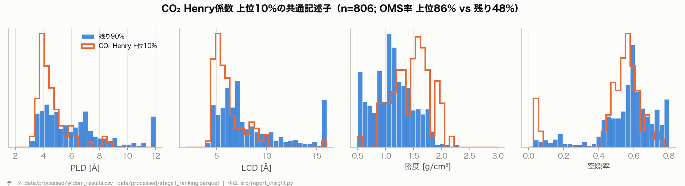
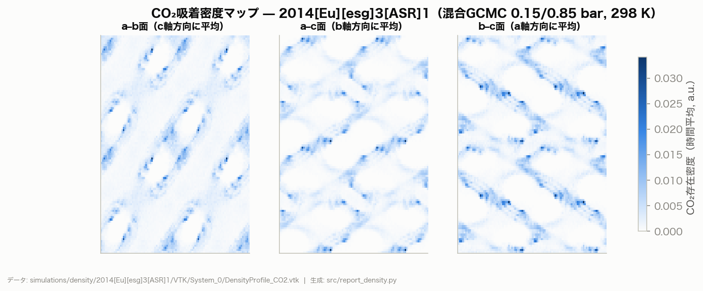

<!-- _class: dense -->

# MOFスクリーニング 中間技術報告

## 概要（このページで全体がわかる）

**目的**: 水安定・湿度下でもCO₂を吸着できるMOFを、公開データベース（12万構造超）から選定する

**現在地**: 全4 Stageのうち Stage 1（物理ベース粗選別）まで完了。**混合GCMC本番の投入リスト471件を確定**

| 実績 | 数字 |
|---|---|
| 母集団（高価数金属・多孔性・水安定ゲート通過） | **2,475件**（Tier A 433 / B 927 / C 1,115） |
| Widom挿入によるHenry係数計算 | **806件 全数成功**（警告ゼロ、~5分/件） |
| 物理粗選別の妥当性（Henry vs GCMC実測の順位相関） | **ρ = 0.87** |
| GCMC本番投入リスト | **471件**（うち擬化学吸着フラグ15件を分離） |

**主要な知見**
1. **ML粗選別は実験構造で機能しない**（順位相関ρ≈0.15）→ Widom挿入（物理計算）へ転換し解決
2. 上位MOFの共通像 = **狭細孔（PLD 3.5-5Å）× 高密度 × OMS（配位不飽和金属サイト）**
3. ただし乾燥条件の勝者は**親水寄りに偏る** → 湿潤チェック（Stage 2→3）で順位逆転が濃厚

**次のアクション**: GCMC本番（承認待ち、ローカル~5日 or クラウド~$100/1日）

---

# 1. 目的と要件

## ターゲット: 湿潤排ガスからのCO₂回収（0.15 bar CO₂, ~313 K, 高RH）

実排ガスは湿潤であり、乾燥条件の高性能MOF（Mg-MOF-74, HKUST-1等）は
**水で容量が激減または構造崩壊**する。本スクリーニングは最初から2条件を課す:

1. **H₂Oに対する構造安定性** — 金属価数（電荷密度）が加水分解耐性を支配するため、
   **高価数金属（Zr⁴⁺/Al³⁺/Cr³⁺/Ti⁴⁺/Fe³⁺/ランタノイド）のみを母集団とする**
2. **湿度環境下でのCO₂吸着** — 疎水性指標・湿潤チェックをファネルに組み込む

## 設計原則（文献調査より）

- 単純指標はプロセス性能と相関しない（Farmahini *Chem.Rev.* 2021）→ **ゲートとランキングを分離**
- 湿潤の真のボトルネックは安定性（Kwon 2025）→ 金属フィルタを母集団定義の第一原理に
- 詳細: `docs/literature_survey_ml_mof_screening.md` / `docs/metrics_survey_mof_screening.md`

---

# 2. データ基盤

| データベース | 規模 | 役割 |
|---|---|---|
| **MOSAEC-DB** (2025) | 124,469 | 母集団の土台。金属**酸化状態検証済み**の実験構造 |
| **CoRE MOF 2024/25** | 43,439 | 水安定性ML確率・KH疎水性クラス・PACMAN電荷・CIF |
| **BW-DB** (Boyd 2019) | 324,426 | ML教師データ（0.15 bar混合GCMC・吸着熱） |
| Keskin 2018 / WS24 | 3,816 / 1,092 | 実験構造での校正 / 水安定性の実験ラベル |

- すべて取得・突合済み（結合キー: CSD refcode）。取得は `src/download.py` で再現可能
- CoRE CSD-modified CIF群（21,009件）はCCDC無料登録で取得（CC BY-NC-SA、アカデミック利用）

---

# 3. Stage 0: 母集団構築（ファネル）

- 水安定性の根拠は優先順位付き: **WS24実験ラベル > CoRE ML確率 > 金属ヒューリスティクス**
- アミン官能基持ち144件は**Track 2（化学吸着候補）に分離**（古典力場では定量予測不能なため）

**Track 1 = 2,475件**（Tier A: Zr/Hf/Ti/Al/Cr純系 433 / B: +Fe/Sc/In/Ga 927 / C: +ランタノイド 1,115）

---

# 4. ML粗選別の検証と方針転換（本プロジェクト最大の判断）

- BW-DB 32万件で学習したLightGBM（リーク対策済みOOF R²=0.59-0.83）を
  実験構造20件のGCMC実測と突合 → **順位相関 ρ=0.16（ほぼ無相関）**
- 原因: 教師DB（仮想MOF, Cu/Zn主体・大細孔）と母集団（高価数・狭細孔・高密度）の
  **化学空間の乖離**（ドメインシフト）。文献の警告（Moosavi 2020）どおり
- **判断: 粗選別をWidom挿入（物理計算）に置換**。MLは診断用に降格

---

# 5. 物理ベース粗選別（Widom挿入）の妥当性

## 転換の成否を数字で確認

| 検証項目 | 結果 |
|---|---|
| 計算成功率 | **806/806件、RASPA警告ゼロ** |
| サイクル削減（20,000→5,000）の誤差 | **1%**（基準構造での突合） |
| **Henry係数 vs GCMC実測吸着量の順位相関** | **ρ = 0.87**（MLは0.16だった） |
| 計算コスト | ~5分/件（MLの代替として実用的） |

---

# 6. GCMCパイプラインの検証（パイロット20構造）

- 全20件成功・警告ゼロ。収束トレースで「プラトー到達後に統計収集」を確認
- 実行時間は吸着量にほぼ比例（平均3.0 h/件）→ 計算計画の根拠
- 開発過程で踏んだ落とし穴と対処は `docs/dev_log.md` に記録
  （例: CIF原子ラベルと力場のマッチング不全 → `RemoveAtomNumberCodeFromLabel yes` で解決）

---

# 7. 暫定上位構造（乾燥条件GCMC実測）

| 構造 | Tier | CO₂ [mmol/g] | CO₂/N₂選択性 | 備考 |
|---|---|---|---|---|
| 2022[Tb][umc]3 | C | **6.88** | 310 | OMSあり。CALF-20実測(2.6)超え |
| 2020[Sc][nan]3 | B | 5.81 | 123 | OMSあり |
| 2014[Eu][esg]3 | C | 4.87 | 86 | OMSあり（密度マップ解析対象） |
| 2019[Zr][scu]3 | **A** | 3.48 | 63 | OMSあり。**水安定本命Tierの最上位** |
| 2019[In][kgd]2 | B | 2.63 | 36 | OMSなしでは最上位級 |

**注意: これは乾燥条件の順位**。上位はOMS持ちに偏っており、湿潤チェックで入れ替わる見込み（次頁）

---

# 8. なぜ上位MOFは強いのか — 記述子分析

1. **吸着量は幾何でなくOMSが支配**（3.6倍差。幾何記述子は|ρ|<0.1）
2. **選択性は「密で狭い」ほど高い**（密度ρ=+0.63、空隙率ρ=−0.59）— 閉じ込め＋静電場
3. **乾燥の勝者は親水寄り** — 強い静電サイトはCO₂も水も引き付ける
   → 湿潤CO₂回収の核心的ジレンマ。**湿潤チェックが最終順位を決める**

---

# 8b. 上位10%の共通記述子（Widom全806件で再現）

- CO₂ Henry上位10%: **PLD 3.5-5 Åに鋭く集中 / 高密度側 / OMS率82%**（残りは46%）
- パイロット（n=20）の発見がn=806で再現 → 「狭・密・OMS」を上位共通像として確定

---

# 8c. 吸着サイトの空間分布（密度マップ・スナップショット）

- CO₂は細孔内に一様分布せず**チャネル壁沿いの特定サイトに局在** — 「結合サイトの強さが支配」の空間的裏付け
- 瞬間スナップショット（fig13）・対話的3Dビュー（`docs/viewer_*.html`）も生成済み

---

# 9. Stage 2（GCMC本番）投入リスト — 471件確定

| 分類 | 件数 | 選定理由 |
|---|---|---|
| Henry係数上位（通常域） | 300 | 物理ベースの主ランキング |
| Tier A 全件（Widom済み分） | 195 | 水安定性の本命は成績に依らず全数計算 |
| **擬化学吸着フラグ**（KH > 1 mol/kg/Pa） | 15 | **古典力場の信頼域外として分離**・別枠レビュー |
| 合計（重複除く） | **471** | Tier内訳: A 195 / B 28 / C 248 |

- 擬化学吸着群（Henry選択性10⁶-10⁸）は非物理的に深い静電トラップ。
  Track 2（アミン系）と同じく「予測できないものを予測できると偽らない」扱い
- データ: `data/processed/stage2_targets.csv`

**計算計画（要承認）**: サイクル半減で **ローカル~5日** / クラウドスポット **~$100で1日**

---

# 10. 制約と限界（正直な記載）

1. **古典力場のOMS精度** — UFF+点電荷はOMSでの精度が最も低い（Uni-MOF論文でも外れ値の80%がOMS持ち）。上位のOMS群の絶対値は過大評価の可能性。対策: 擬化学吸着フラグ分離＋最終候補でのQst感度確認
2. **乾燥条件のみ**（現時点）— 湿潤チェック（E(CO₂)≥E(H₂O)または湿潤保持率）はStage 2→3で実施。親水上位群の失速を予想
3. **CIFカバレッジ** — Widom済みは806/2,475件。残りはCoRE未収録のMOSAEC構造（CSDライセンス必要）。最終候補に限りCCDC Access Structuresで個別取得可能
4. **ランタノイドの水安定性** — Tier CはCoRE MLラベル頼み（実験ラベルは50件のみ）。最終候補では文献裏取りを行う

---

# 11. 次のステップ

## 承認いただきたいこと

- [ ] **GCMC本番の開始**（471件、ローカル~5日 or クラウド~$100）

## その後の自動実行

1. 混合GCMC（吸着点）→ 作業容量・選択性のParetoランキング
2. **湿潤チェック**: 上位候補にH₂O競合評価（サイトエネルギー比較 / 三成分GCMC）
3. 統合ランキング → **最終候補~50件** ＋ サニティチェック（CALF-20等の文献値と比較）
4. 最終報告書（本資料の完全版）

## 参照

- 全図の元データ対応: `docs/figures/README.md` ｜ 開発経緯と判断理由: `docs/dev_log.md`
- 分析詳細: `docs/insight_why_top.md` ｜ 先行研究: `docs/literature_survey_*.md`
